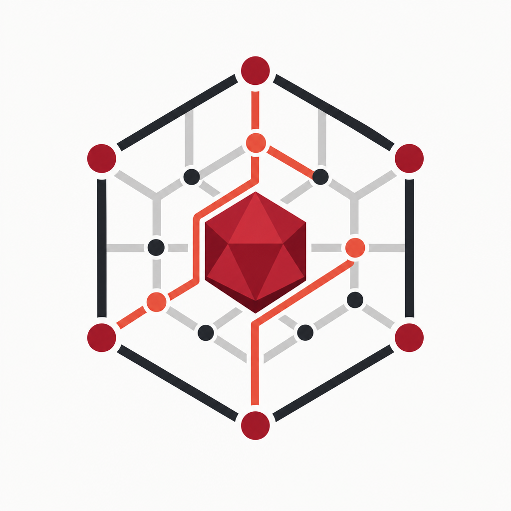

<p align="center">
  
</p>

<h1 align="center">ruby_llm_mesh</h1>

<p align="center">
  Unified multi-provider AI routing for Ruby &amp; Rails<br/>
  <code>AiAgentRouter</code> · circuit breaking · fallback · RAG helpers
</p>

<p align="center">
  <a href="https://rubygems.org/gems/ruby_llm_mesh"></a>
  <a href="https://github.com/theworker02/ruby_llm_mesh/actions/workflows/ci.yml"></a>
  <a href="LICENSE.txt"></a>
  <a href="https://theworker02.github.io/ruby_llm_mesh/"></a>
</p>

<p align="center">
  <strong>Install from RubyGems:</strong>
  <a href="https://rubygems.org/gems/ruby_llm_mesh">https://rubygems.org/gems/ruby_llm_mesh</a>
</p>

## What it does

`ruby_llm_mesh` routes prompts across OpenAI, Anthropic, and local OpenAI-compatible nodes with a single DSL. When a provider fails or its circuit is open, the router can fall through the rest of the ladder. Lightweight RAG helpers and an optional ActiveRecord mixin are included for Rails apps.

## Install

```bash
gem install ruby_llm_mesh
```

Or in a Gemfile:

```ruby
gem "ruby_llm_mesh"
```

Then `bundle install`.

Gem page: [rubygems.org/gems/ruby_llm_mesh](https://rubygems.org/gems/ruby_llm_mesh)

## Quickstart

```ruby
require "ruby_llm_mesh"

AiAgentRouter.configure do |c|
  c.openai_api_key = ENV["OPENAI_API_KEY"]
  c.anthropic_api_key = ENV["ANTHROPIC_API_KEY"]
  c.local_node_base_url = "http://127.0.0.1:11434"
  c.default_providers = %i[anthropic openai local_node]
  c.fallback = true
end

response = AiAgentRouter.complete(
  prompt: "Summarize circuit breakers in one sentence.",
  providers: %i[anthropic openai local_node],
  fallback: true
)

puts response.content
puts response.provider      # => :anthropic (or next healthy provider)
puts response.fallback_used # => true if a later provider was used
```

`RubyLlmMesh.complete` is the same entry point; `AiAgentRouter` is the public product alias.

## Configuration

| Option | Default | Description |
|--------|---------|-------------|
| `default_providers` | `%i[openai anthropic local_node]` | Provider ladder order |
| `fallback` | `true` | Continue to next provider on failure |
| `timeout` | `30` | HTTP open/read timeout (seconds) |
| `openai_api_key` / `openai_base_url` / `openai_model` | env / `https://api.openai.com/v1` / `gpt-4o-mini` | OpenAI settings |
| `anthropic_api_key` / `anthropic_base_url` / `anthropic_model` | env / `https://api.anthropic.com` / `claude-sonnet-4-5` | Anthropic settings |
| `local_node_base_url` / `local_node_model` | `http://127.0.0.1:11434` / `llama3.2` | Local node settings |
| `circuit_failure_threshold` | `3` | Failures before opening a circuit |
| `circuit_reset_timeout` | `60` | Seconds before half-open retry |
| `logger` | `nil` | Object responding to `#info` / `#warn` / `#error` or `#call` |

Environment variables (`OPENAI_API_KEY`, `ANTHROPIC_API_KEY`, `LOCAL_NODE_BASE_URL`, etc.) are read automatically when present.

## Providers

- **`:openai`** — Chat Completions API
- **`:anthropic`** — Messages API
- **`:local_node`** — OpenAI-compatible `/v1/chat/completions`, with a fallback to Ollama’s `/api/chat` on 404

Unknown providers raise `RubyLlmMesh::ProviderError` and are skipped in the ladder when fallback is enabled.

## Circuit breaker & fallback

Each provider has an independent circuit. After `circuit_failure_threshold` consecutive failures (or a failure while half-open), the circuit opens for `circuit_reset_timeout` seconds. Open circuits are skipped; the router continues down the ladder when `fallback: true`.

If every provider fails, `RubyLlmMesh::AllProvidersFailedError` is raised with a per-provider error map.

```ruby
breaker = RubyLlmMesh::Router.circuit_breaker
breaker.state_for(:openai) # => :closed | :open | :half_open
RubyLlmMesh::Router.reset_circuit_breaker!
```

## RAG helpers

```ruby
chunks = RubyLlmMesh::Rag::Chunker.new(size: 500, overlap: 50).chunk(long_text)

embedder = RubyLlmMesh::Rag::Embeddings.new(dimensions: 256)
hits = embedder.top_k("billing refunds", documents, k: 3)

tool = RubyLlmMesh::Rag::Tools.define(
  name: "lookup_order",
  description: "Fetch an order by id",
  parameters: { order_id: { type: "string" } },
  required: [:order_id]
)
openai_tools = RubyLlmMesh::Rag::Tools.for_openai([tool])
```

The built-in embedder is a local bag-of-words helper for prototyping. Swap in a production embedding API when you need higher quality vectors.

## Rails: `acts_as_ai_agent`

The railtie loads only when Rails is present. On ActiveRecord models:

```ruby
class Conversation < ApplicationRecord
  acts_as_ai_agent
  # expects JSON/text columns: messages, semantic_cache, ai_audits (configurable)
end

conversation = Conversation.create!
response = conversation.ai_complete("What did we discuss last?", providers: %i[openai])
```

Hooks provide conversational memory, a simple prompt→response cache, and an audit trail. Attribute names are configurable via `acts_as_ai_agent(memory_attribute:, cache_attribute:, audit_attribute:)`.

## Branding

Primary colors from the project logo:

| Token | Hex |
|-------|-----|
| Ruby | `#9B1B30` |
| Coral | `#E85D4C` |
| Charcoal | `#1A1A1A` |

Docs site: [https://theworker02.github.io/ruby_llm_mesh/](https://theworker02.github.io/ruby_llm_mesh/)

## Development

```bash
bundle install
bundle exec rake test
```

See [CONTRIBUTING.md](CONTRIBUTING.md).

## Trusted publishing (RubyGems)

Releases are intended to publish via [RubyGems Trusted Publishing](https://guides.rubygems.org/trusted-publishing/) using `.github/workflows/push_gem.yml` on tags matching `v*`.

Configure a **pending trusted publisher** (first release) or trusted publisher at:

[https://rubygems.org/profile/oidc_pending_trusted_publishers](https://rubygems.org/profile/oidc_pending_trusted_publishers)

| Field | Value |
|-------|-------|
| Gem name | `ruby_llm_mesh` |
| GitHub repository owner | `theworker02` |
| GitHub repository name | `ruby_llm_mesh` |
| Workflow filename | `push_gem.yml` |
| Environment name | `release` |

Also create a GitHub Environment named `release` on the repository (Settings → Environments). Pushing tag `v0.1.0` (or later) runs the workflow with `id-token: write` and publishes via `rubygems/release-gem`.

## Built with

Designed with [Cursor](https://cursor.com) models Opus and Fable 5.

## License

MIT — see [LICENSE.txt](LICENSE.txt).
